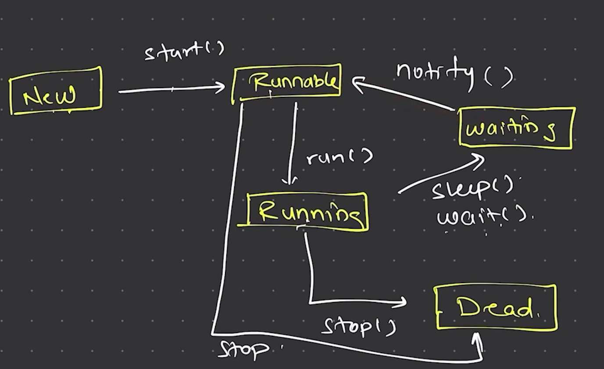

# Threads

Threads are used to run the process or some task in parallel.
We have two ways to create a new Thread by extending `Thread` class or by implementing `Runnable` interface.

1. Thread Class : It also implements the Runnable interface but also add the lots of methods to with it.

We calls the `start()` method of an Thread class and it required to override the `run()` method in the child class which implements the `Thread` class.

2. Runnable interface : We can use this interface to implements the Threads we also needs to override the `run()` method in the child class.
But if we need to run the `start()` method and the methods of Thread class we can create the Thread class object from the Runnable interface class by passing the object reference in Thread class constructor.

Note : 1. We can optimize the Threads but can't decide the execution of the thread as it depends on the OS of the system and the Schedular Algorithm to which thread to pick.

2. Lambda Expressions only works on Functional Interfaces.

`join()` method is used to stop the calling Thread for execution util it completes it execution and then the calling Thread continues its execution.
[Count.java](./Count.java).

When we are doing READ and WRITE on a resource using Threads we will see some un expected outputs because threads run parallels so it may some times override the same value in the resource.
it is called `Race Condition`

## Threads Life Cycle

# Collection Api 

It simply means the concept of collections 

# Collection 

It means the Interface which used by the some classes

# Collections 
It means the class which have multiple methods which we  can use 